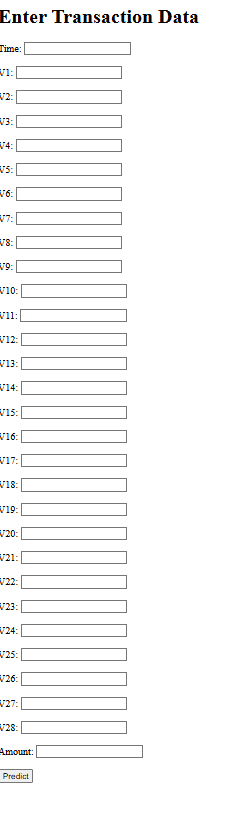
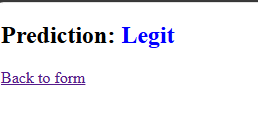
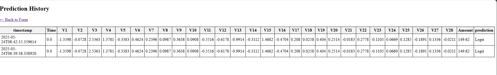
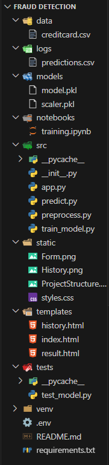

## AI-Powered Fraud Detection System

This project uses machine learning to detect fraudulent financial transactions. It provides a Flask-powered web dashboard with real-time predictions and logging. Users can manually input transaction data, see results, and view a history of predictions in a clean, Bootstrap-styled UI.

---

## Features

Predict if a transaction is Fraudulent or Legit.

Flask web interface with real-time input.

Transaction logging and history table.

Optional JSON API endpoint for external apps.

Ready for deployment on Render/Heroku.

---

## Screenshots
1. Form



2. Result

  

3. History



---

## Tech Stack

1. Python 3
2. Flask
3. Scikit-learn (IsolationForest)
4. HTML + Jinja Templates**
5. CSV Logging

---

## Model & Dataset

Dataset: [Kaggle Credit Card Fraud Detection](https://www.kaggle.com/datasets/mlg-ulb/creditcardfraud)

Model: Isolation Forest (Unsupervised Anomaly Detection)

Preprocessing: Feature scaling with `StandardScaler`

---

## Getting Started

1.Clone the Repository

```bash
git clone https://github.com/Chetan-Singh04/Fraud-Detection
cd fraud-detection-app
```
2.Set Up Virtual Environment

```bash
python -m venv venv
venv\Scripts\activate  # Windows
# OR
source venv/bin/activate  # macOS/Linux
```
3.Install Dependencies

```bash
pip install -r requirements.txt
```
4.Add Dataset

Download `creditcard.csv` from [Kaggle](https://www.kaggle.com/datasets/mlg-ulb/creditcardfraud)
Put it inside the `data/` folder.

5.Train the Model

```bash
python src/train_model.py
```
This saves:

* `models/model.pkl`
* `models/scaler.pkl`

6.Run the Web App

```bash
set PYTHONPATH=.
python src/app.py
```

Now open: [http://127.0.0.1:5000](http://127.0.0.1:5000)

7.Test the JSON API (Optional)

```bash
curl -X POST http://127.0.0.1:5000/predict ^
     -H "Content-Type: application/json" ^
     -d "{\"V1\": -1.35, ..., \"Amount\": 149.62, \"Time\": 0.0}"
```
---

## Project Structure

```
fraud-detection/
├── data/                ← Dataset (creditcard.csv)
├── logs/                ← CSV file storing predictions
├── models/              ← Trained ML model + scaler
├── notebooks/           ← Jupyter notebook for training
├── src/                 ← Flask API & model code
│   ├── app.py
│   ├── predict.py
│   └── train_model.py
├── static/              ← styles.css, screenshots
├── templates/           ← HTML (Jinja2) files
├── tests/               ← Unit tests
├── requirements.txt
├── .env
└── README.md
```
ScreenShot of complete Project Structure

  

---

## Routes Summary

| Route         | Method | Description                        |
|---------------|--------|------------------------------------|
| `/`           | GET    | Form to input transaction data     |
| `/predict-form` | POST   | Submits form and displays result  |
| `/predict`    | POST   | JSON API endpoint                  |
| `/history`    | GET    | View all previous predictions      |
| `/static/`    | GET    | Serves CSS and static assets       |

## Future Enhancements

1.Add Chart.js graphs for fraud trends.

2.Deploy live on Render or Heroku.

3.Add user authentication for admins.

4.Switch to XGBoost or deep learning for better precision.

